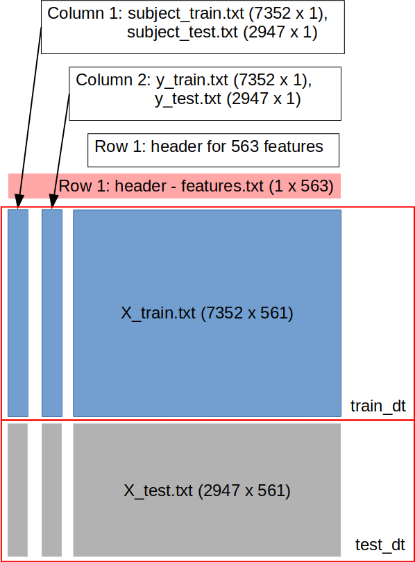

# Data Cleaning Course Project

**Introduction**

The purpose of this project is to demonstrate my ability to collect, work with, and clean a data set. The data is assembled into one large dataframe in order to find the mean and standard deviations of the columns as a check for putting the datasets together properly.

The [Human Activity Recognition Using Smartphones Dataset, Version 1.0](https://archive.ics.uci.edu/ml/datasets/Human+Activity+Recognition+Using+Smartphones) found at the UCI data repository is eight(8) files. Six(7) of these files will be bound together to provide one dataframe as further described in the *codebook.md*.

**Here are the INPUT data for the project:**

|  #  | File Name             | Dimensions (R x C) |
| :-: | :-------------------- | :----------------- |
|  1  | `subject_test.txt`    |           2947 x 1 |
|  2  | `y_test.txt`          |           2947 x 1 |
|  3  | `X_test.txt`          |         2947 x 561 |
|  4  | `subject_train.txt`   |           7352 x 1 |
|  5  | `y_train.txt`         |           7352 x 1 |
|  6  | `X_train.txt`         |         7352 x 561 |
|  7  | `features.txt`        |            561 x 1 |
|  8  | `activity_labels.txt` |              6 x 2 |

The best way for me to explain the data organization (even to myself) is to use a diagram.

 
**Dimensions of Final dataset = [10300 R x 563 C]**

**The OUTPUT** data for this project is:

| #   | File Name          | Description |
| :-- | :----------------  | :---------- |
| 1   | run\_analysis.rmd  | R code used for transformations and analysis |
| 2   | run\_analysis.html | run\_analysis.rmd transformed to HTML for easier viewing |
| 3   | README.md          | Helpful Information  |
| 4   | dataframes.png     | Diagram depicting data output of merged file |
| 5   | code_book.md       | A file describing the steps used to investigate and transform the input data. |

For Further Assistance Contact:
MCC / mockrun [@] gmail [.] com

